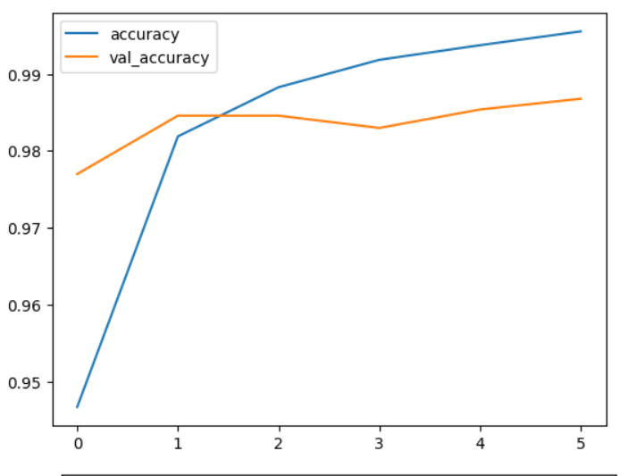
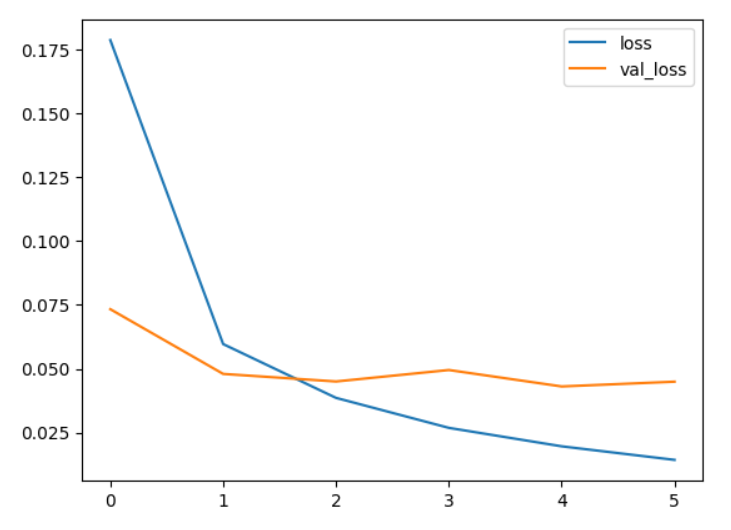
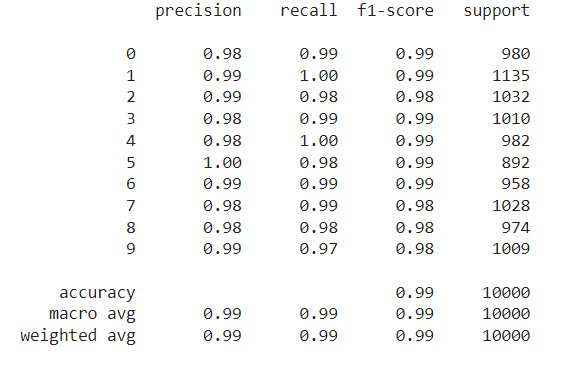
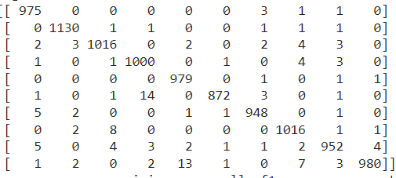
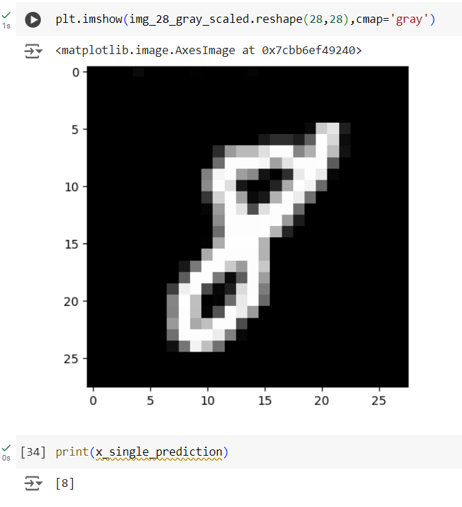

# Convolutional Deep Neural Network for Digit Classification

## AIM

To Develop a convolutional deep neural network for digit classification and to verify the response for scanned handwritten images.

## Problem Statement and Dataset
To Develop a convolutional deep neural network (CNN) to classify hand-written digits. The goal is to accurately identify digits from 0 to 9 based on scanned images of handwritten digits. Additionally, the model should be capable of handling scanned handwritten images that are not part of the standard dataset.

The MNIST dataset stands as a cornerstone in both machine learning and computer vision, offering a standardized benchmark for evaluating models. Comprising 28x28 pixel grayscale images depicting handwritten digits from 0 to 9, it includes a meticulously divided training set of 60,000 images and a test set of 10,000 images. Each image's grayscale representation spans pixel values from 0 to 255, where 0 signifies black and 255 denotes white. Researchers and practitioners extensively utilize this dataset to train and assess a multitude of machine learning models, particularly focusing on digit recognition tasks. Leveraging MNIST, we aim to develop and scrutinize a convolutional deep neural network tailored specifically for digit classification while also assessing its adaptability and generalization capabilities through real-world scanned handwritten images not present in the dataset.


## Neural Network Model


## DESIGN STEPS
### STEP 1:
Import tensorflow and preprocessing libraries.

### STEP 2:
Download and load the dataset

### STEP 3:
Scale the dataset between it's min and max values

### STEP 4:
Using one hot encode, encode the categorical values

### STEP 5:
Split the data into train and test

### STEP 6:
Build the convolutional neural network model

### STEP 7:
Train the model with the training data

### STEP 8:
Plot the performance plot
### STEP 9:
Evaluate the model with the testing data

### STEP 10:
Fit the model and predict the single input


## PROGRAM

### Name:Bala Sathiesh CS
### Register Number:212222040022

```
import numpy as np
from tensorflow import keras
from tensorflow.keras import layers
from tensorflow.keras.datasets import mnist
import tensorflow as tf
import matplotlib.pyplot as plt
from tensorflow.keras import utils
import pandas as pd
from sklearn.metrics import classification_report,confusion_matrix
from tensorflow.keras.preprocessing import image
(X_train, y_train), (X_test, y_test) = mnist.load_data()
X_train.shape
single_image=X_train[0]
single_image.shape
plt.imshow(single_image,cmap='gray')
print("BALA SATHIESH C S\n212222040022")
y_train.shape
X_train.min()
X_train_scaled = X_train/255.0
X_test_scaled = X_test/255.0
X_train_scaled.min()
X_train_scaled.max()
y_train[0]
y_train_onehot = utils.to_categorical(y_train,10)
y_test_onehot = utils.to_categorical(y_test,10)
type(y_train_onehot)
y_train_onehot.shape
single_image = X_train[501]
plt.imshow(single_image,cmap='gray')
print("BALA SATHIESH C S\n212222040022")
y_train_onehot[501]
X_train_scaled = X_train_scaled.reshape(-1,28,28,1)
X_test_scaled = X_test_scaled.reshape(-1,28,28,1)
model=keras.Sequential()
model.add(layers.Input(shape=((28,28,1))))
model.add(layers.Conv2D(32,kernel_size=(3,3),activation='relu'))
model.add(layers.MaxPooling2D(pool_size=(2,2)))
model.add(layers.Flatten())
model.add(layers.Dense(128,activation='relu'))
model.add(layers.Dense(10,activation='softmax'))
model.summary()
model.compile(loss='categorical_crossentropy', optimizer='adam', metrics=['accuracy'])
model.fit(X_train_scaled ,y_train_onehot, epochs=6,batch_size=64,validation_data=(X_test_scaled,y_test_onehot))
metrics = pd.DataFrame(model.history.history)
metrics.head()
metrics[['accuracy','val_accuracy']].plot()
metrics[['loss','val_loss']].plot()
x_test_predictions = np.argmax(model.predict(X_test_scaled), axis=1)
print("Name:Bala Sathiesh CS")
print("Reg no:212222040022")
print(confusion_matrix(y_test,x_test_predictions))
print(classification_report(y_test,x_test_predictions))
img = image.load_img('/content/DP image.png')
img_tensor = tf.convert_to_tensor(np.asarray(img))
img_28 = tf.image.resize(img_tensor,(28,28))
img_28_gray = tf.image.rgb_to_grayscale(img_28)
img_28_gray_scaled = img_28_gray.numpy()/255.0
x_single_prediction = np.argmax(
    model.predict(img_28_gray_scaled.reshape(1,28,28,1)),
     axis=1)
print(x_single_prediction)
plt.imshow(img_28_gray_scaled.reshape(28,28),cmap='gray')
```

## OUTPUT

### Training Loss, Validation Loss Vs Iteration Plot




### Classification Report



### Confusion Matrix



### New Sample Data Prediction



## RESULT
Therefore a model has been successfully created for digit classification using mnist dataset.
